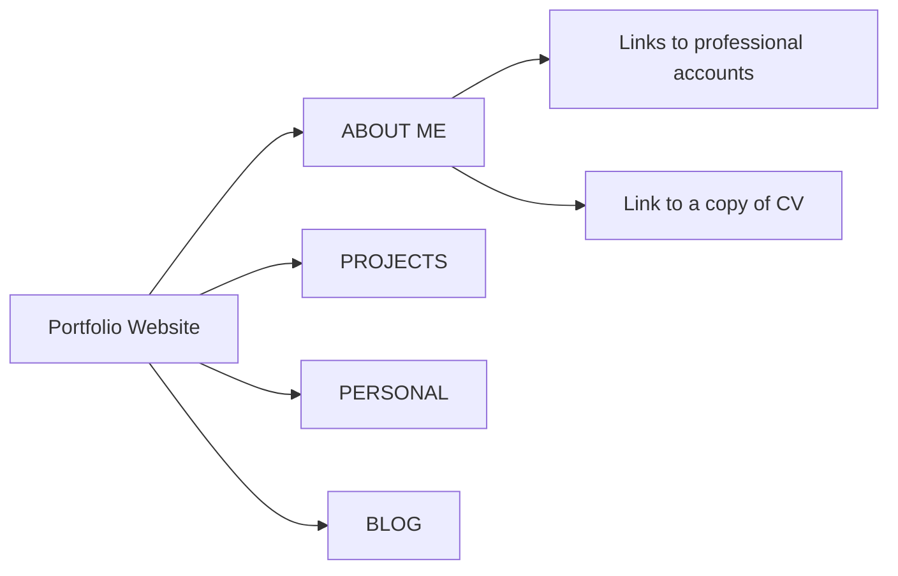

## Irina Mogozova
## T1A2 - Portfolio
1. A link (URL) to portfolio website: [https://mogoziri.github.io](https://mogoziri.github.io)
2. A link to GitHub repo: [https://github.com/mogoziri/mogoziri.github.io](https://github.com/mogoziri/mogoziri.github.io)
3. Description of portfolio website:

    a) Purpose: to showcase my knowledge and skills
    
    b) Functionality / features: 
    - Links to professional accounts
    - Link to a copy of CV
    - Contact Form 
    - List of projects 
    - Blog 
    - Responsive design
    
    c) Screenshots
    
    
    
    

    d) The main target audience are future employers
    
    e) Tech stack: HTML5, CSS3 
    
    f) Portfolio Sitemap
 

